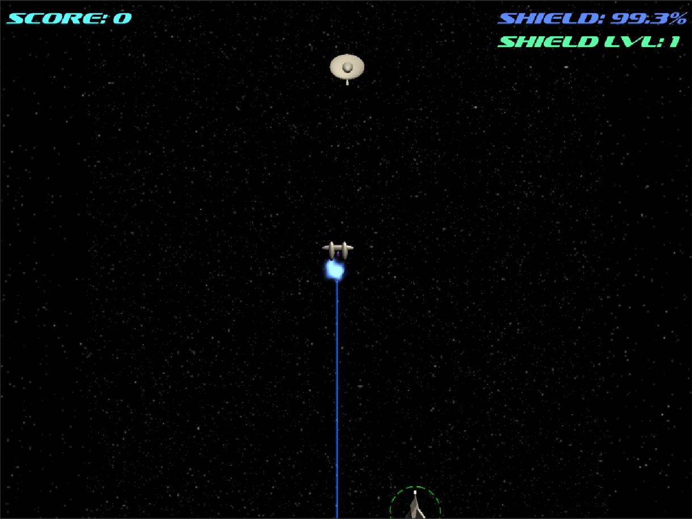

# Ultimate SHMUP++
This project was created as a part of "Advanced Game Development" class at the College of Staten Island (CUNY) in November 2020

## Authors
- <a href="https://github.com/konstantinNovichenko">Konstantin Novichenko</a>
- Jeremy Gibson

## Overview
This project is a modification of the basic 'Shoot 'Em Up' game from the "Introduction to Game Design, Prototyping, and Development" by Jeremy Gibson.
The purpose of this project is to extend the base game using various software design patterns.

## Content
- Source code in "Ultimate SHMUP++/Assets/__Scripts/" folder
- Executable file is "Ultimate SHMUP++/Executable/Ultimate SHMUP++.exe"

## List of Improvements
- Two new weapon types:
  - Laser – blue laser beam that deals damage to the ships over time. It can destroy projectiles or missiles on collision. Not very powerful to destroy the ships easily but very good to protect from missile and projectiles.
  - Missile – a homing missile that deals a lot of damage. It follows the closest target, which could be an enemy, a Hero, or another missile. If the target is destroyed before a missile reaches it, the missile looks for another target. The missile explodes if there are no available targets on the screen. It has the lowest chance of being spawned as a power-up. It’s also very deadly in the hands of enemies since it clears two levels of Hero’s shield instantly. In some cases, it could mean a game over from one shot. Using a laser is a very effective defense against the missile. If there is no laser available, Hero can outrun the missile by circling - move up to create a distance and then move down behind the missile to get a clear shot on it. This move is a tough one since you have to avoid other ships and projectiles. But nobody said that being a space pilot is easy, right?
- Each enemy except Enemy_0 can shoot weapons. Enemy_1 shoots Blaster, Enemy_2 shoots Missiles, Enemy_3 shoots Laser, Enemy_4 shoots Spread Blaster, and Enemy_5 shoots all of those weapon types.
-	New Enemy Type Enemy_5:     
    * It looks like a bigger version of Enemy_0 but with a rotating blue disk.
    * Randomly chooses one of the three move strategies: move like Enemy_1, move like Enemy_2, or move like Enemy_4. Each strategy has an “end of the move” condition that triggers choosing a random move strategy again.
    * Randomly chooses one of the 4 weapon types at the same time when choosing a move strategy.
    * Has a relatively short cooldown time for shooting
    * Has more health points than any other enemy
    * Has the least chance of being spawned
    * The hardest enemy unit in the game
    * Gives the highest amount of scores for destroying it
-	GUI:
    - Displays score count
    - Displays the current shield level
    - Displays the current condition of the shield in percent (used for laser damage)
    - Displays ‘Game Over” message when Hero is destroyed
- Weapons do different levels of damage:
    - Laser deals a small amount of damage over time. The weakest offensive weapon but great for defense against homing missiles.
    - Blaster projectile deals a moderate amount of damage. The projectile is very small object. Thus, it’s hard to use for defense against missiles.
    - Missile deals a massive amount of damage. The best weapon in the game. Good for offense and defense. Very dangerous in the hands of enemies.
-	Sound:
    - Background music
    - Blaster shooting sound effect
    - Laser continuous shooting sound effect
    - Flying missile sound effect
    - Missile explosion sound effect
    - Enemy damage sound effect
    - Hero damage sound effect
    - Power-Up sound effect

## Screenshots

### Homing Missile

### Laser

